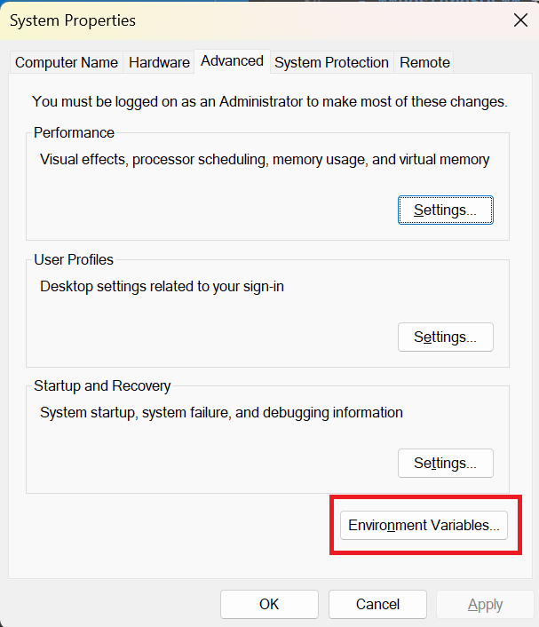

# Cryptocurreny Personal Assistant

<p align="center">
  
</p>

Investing in cryptocurrency has recently become very popular, especially among young people. Many people are tempted to put their money into this instrumentation, in the hope of making big money in a short time.

But this instrumentation is not easy. Due to the rapid release of new products, changes in the narrative trend of cryptocurrencies, very fast price fluctuations, and so on, many beginners often end up experiencing losses rather than profits.

Therefore, I am interested in creating this project with the hope that in the future this project can help many beginners to learn and invest in the right crypto instrumentation assets.

This project was implemented for 
[LLM Zoomcamp](https://github.com/DataTalksClub/llm-zoomcamp) -
a free course about LLMs and RAG.

<p align="center">
  
</p>

## System Architecture

<p align="center">
  
</p>

The technology we use in this project :

- **Python 3.11.9**
- **Docker** and **Docker Compose** for containerization
- **Elastic Search** for full-text and vector search
- **Streamlit** as the Website User Interface
- **Grafana** for dashboard monitoring
- **PostgreSQL** for database to store activity user
- **Ollama** as an LLM hosting on local
- **Airflow** as Data Ingestion Pipeline and Scheduler
- **Beautiful Soup** as Web Scraper

## Preparation

Since we use OpenAI, you need to provide the API key:

### Windows
1. First, you need to open Environment Variables
<p align="center">
  
</p>
2. Next, click Environment Variables button
<p align="center">
  
</p>
3. Add new variable with the name **OPENAI_API_KEY**
<p align="center">
  
</p>

4. After that, you can install anaconda and create a new environment, because we need that to run our preparation script before running application :
You can download [Anaconda](https://www.anaconda.com/download?utm_source=anacondadoc&utm_medium=documentation&utm_campaign=download&utm_content=topnavalldocs) based on your platform (Mac / Windows)

5. Now, after that, you can open Anaconda and create a new environment.
I will give it a name 'llm_crypto'
<p align="center">
  
</p>

<p align="center">
  
</p>

6. Next, open the terminal, because we will install some packages which needed to run our preparation script.
<p align="center">
  
</p>

7. Now, you can install the packages which needed using this command :
```bash
pip install tqdm notebook==7.1.2 openai elasticsearch pandas scikit-learn ipywidgets
```
<p align="center">
  
</p>
8. You must install Docker Desktop, because we need that to run our images application.
You can download in this [url](https://www.docker.com/products/docker-desktop/)
9. After that, open and running Docker Desktop.
<p align="center">
  
</p>
10. Test in the terminal to check if Docker Desktop already installed correctly or not.
<p align="center">
  
</p>

Now, we ready to running the application.

## Running the application
1. Create directory to load llm project to your local.
In this example, I create directory with the name **llm_project_crypto**
2. After that, open the terminal, change directory to that directory
<p align="center">
  
</p>
3. Now, clone llm crypto project repository in github using this command :
```bash
git clone https://github.com/sofianfadli95/llm_crypto.git
```
4. After that, you can change directory to the `llm_crypto\app`
```bash
cd llm_crypto\app
```
<p align="center">
  
</p>
5. Notes : Make sure you already install Docker Desktop to run in this step!!!
Now, you can pull docker images first with command :
```bash
docker-compose pull
```
or you can directly pull images and start running the images in the background with command :
```bash
docker-compose up -d
```