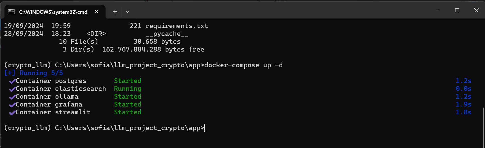

# Cryptocurreny Personal Assistant

<p align="center">
  
</p>

Investing in cryptocurrency has recently become very popular, especially among young people. Many people are tempted to put their money into this instrumentation, in the hope of making big money in a short time.

But this instrumentation is not easy. Due to the rapid release of new products, changes in the narrative trend of cryptocurrencies, very fast price fluctuations, and so on, many beginners often end up experiencing losses rather than profits.

Therefore, I am interested in creating this project with the hope that in the future this project can help many beginners to learn and invest in the right crypto instrumentation assets.

This project was implemented for 
[LLM Zoomcamp](https://github.com/DataTalksClub/llm-zoomcamp) -
a free course about LLMs and RAG.

## Project overview
The Cryptocurreny Personal Assistant is a RAG application designed to assist
users with their investing knowledge :

The main use cases include:
1. Ask basic fundamental : help user to answer anything question related to fundamental in cryptocurreny
2. Ask new product : help user to ask new cryptocurreny product which already released.
3. Find Hot Topics : give user the new information about hot topics in cryptocurreny community.
4. Give Recommendation (Not Yet Develop) : give user recommendation what cryptocurreny good to buy for long or short period of time

## Dataset
The dataset used in this project I get from scraping in website forums.
The data contains question and answer related to the cryptocurrency.

List website which already scraped :
- https://consensys.io/knowledge-base/blockchain-super-faq

Notes : url to be scraped will be growth. 
But for now, due to time constraints, I will try scraping using the existing URL first.

## How to Scraping the FAQ Website?
I create a Python script to do that.
And with the help of Beautiful Soup packages, I can parsed the questions and answers which I needed to be my RAG Knowledged.
The code for the application is in the [`scraper_bot`](scraper_bot/) folder:
- [`scraping_faq.py`](scraper_bot/scraping_faq.py) - Main script to get FAQ data from the target website.

## User Interface for Cryptocurreny Personal Assistant
<p align="center">
  
</p>

## System Architecture

<p align="center">
  
</p>

The technology we use in this project :

- **Python 3.11.9**
- **Docker** and **Docker Compose** for containerization
- **Elastic Search** for full-text and vector search
- **Streamlit** as the Website User Interface
- **Grafana** for dashboard monitoring
- **PostgreSQL** for database to store activity user
- **Ollama** as an LLM hosting on local
- **Airflow** as Data Ingestion Pipeline and Scheduler
- **Beautiful Soup** as Web Scraper

## Preparation

Since we use OpenAI, you need to provide the API key:

### Windows
1. First, you need to open Environment Variables
<p align="center">
  
</p>
2. Next, click Environment Variables button
<p align="center">
  
</p>
3. Add new variable with the name **OPENAI_API_KEY**
<p align="center">
  
</p>

4. After that, you can install anaconda and create a new environment, because we need that to run our preparation script before running application :
You can download [Anaconda](https://www.anaconda.com/download?utm_source=anacondadoc&utm_medium=documentation&utm_campaign=download&utm_content=topnavalldocs) based on your platform (Mac / Windows)

5. Now, after that, you can open Anaconda and create a new environment.
I will give it a name 'llm_crypto'
<p align="center">
  
</p>

<p align="center">
  
</p>

6. Next, open the terminal, because we will install some packages which needed to run our preparation script.
<p align="center">
  
</p>

7. Now, you can install the packages which needed using this command :
```bash
pip install tqdm notebook==7.1.2 openai elasticsearch pandas scikit-learn ipywidgets
```
<p align="center">
  
</p>

8. You must install Docker Desktop, because we need that to run our images application.
You can download in this [url](https://www.docker.com/products/docker-desktop/)

9. After that, open and running Docker Desktop.
<p align="center">
  
</p>

10. Test in the terminal to check if Docker Desktop already installed correctly or not.
```bash
docker --version
```
<p align="center">
  
</p>

Now, we ready to running the application.

## Running the application
1. Create directory to load llm project to your local.
In this example, I create directory with the name **llm_project_crypto**
2. After that, open the terminal, change directory to that directory
<p align="center">
  
</p>

3. Now, clone llm crypto project repository in github using this command :
```bash
git clone https://github.com/sofianfadli95/llm_crypto.git
```
4. After that, you can change directory to the `llm_crypto\app`
```bash
cd llm_crypto\app
```
<p align="center">
  
</p>

5. Notes : Make sure you already install Docker Desktop to run in this step!!!
Now, you can pull docker images first with command :
```bash
docker-compose pull
```
or you can directly pull images and start running the images in the background with command :
```bash
docker-compose up -d
```
<p align="center">
  
</p>

6. You can check too on the Docker Desktop which images already running.
<p align="center">
  
</p>

Now, the application already running.

## Generate initial RAG Data
1. You can open your Anaconda terminal and change directory the llm app project :
For example :
```bash
cd C:\Users\sofia\llm_project_crypto
```
2. Now, run the `prep.py` script with the command :
```bash
python prep.py
```
<p align="center">
  
</p>

## Set Initial Database
1. You can open your Anaconda terminal and change directory the llm app project :
For example :
```bash
cd C:\Users\sofia\llm_project_crypto
```
2. Now, run the `db.py` script with the command :
```bash
python db.py
```

## Application Code

The code for the application is in the [`app`](app/) folder:

- [`app.py`](app/app.py) - Streamlit application, the main entrypoint to the application
- [`assistant.py`](app/assistant.py) - the main RAG logic for building the retrieving the data and building the prompt
- [`generate_data.py`](app/ingest.py) - loading the data into the knowledge base
- [`db.py`](app/db.py) - the logic for logging the requests and responses to postgres
- [`db_prep.py`](app/db_prep.py) - the script for initializing the database

## Data Ingestion Pipeline

We use Airflow for data ingestion pipeline. 

This repository is used to become Data Ingestion Pipeline for ingest data into knowledge base.

<p align="center">
  
</p>

The code for the Airflow Data Pipeline is in the [`airflow_dag`](airflow_dag/) folder:
- [`rag_ingestion.py`](airflow_dag/dags/rag_ingestion.py) - DAG script for scraping, cleaning, transformation, until ingest into knowledge base.
- [`Dockerfile`](airflow_dag/Dockerfile) - Docker file which will created airflow custom images, because we need airflow which has external python packages to create RAG Pipeline.
- [`docker-compose.yaml`](airflow_dag/docker-compose.yaml) - Docker compose file which will created airflow container based on custom airflow images

This is example Web Interface for Airflow :

It's accessible at [localhost:8080](http://localhost:8080):

- Login: "airflow"
- Password: "airflow"

<p align="center">
  
</p>

## Experiments

For experiments, we use Jupyter notebooks.
They are in the [`notebooks`](notebooks/) folder.

To start Jupyter, run:

```bash
cd notebooks
jupyter notebook
```

We have the following notebooks:

- [`Prepare_faq_data.ipynb`](notebooks/Prepare_faq_data.ipynb): Transform data from text format to become json format
- [`rag_intro.ipynb`](notebooks/rag_intro.ipynb): Create RAG Pipeline
- [`ground-truth-data-crypto.ipynb`](notebooks/ground-truth-data-crypto.ipynb): Generating the ground truth dataset for retrieval evaluation.
- [`evaluate-text-crypto.ipynb`](notebooks/evaluate-text-crypto.ipynb): Evaluate searching result based on text search.
- [`evaluate-vector-crypto.ipynb`](notebooks/evaluate-vector-crypto.ipynb): Evaluate searching result based on vector search.
- [`evaluate_using_seaborn.ipynb`](notebooks/evaluate_using_seaborn.ipynb): Compare LLM Result with the original answer for each ChatGPT Model in visualization.
- [`offline-rag-evaluation-crypto.ipynb`](notebooks/offline-rag-evaluation-crypto.ipynb): Evaluate RAG System to generate answer for each ChatGPT Model.
- [`LLM-as-a-Judge.ipynb`](notebooks/LLM-as-a-Judge.ipynb): Evaluate RAG System using LLM as Judge.


